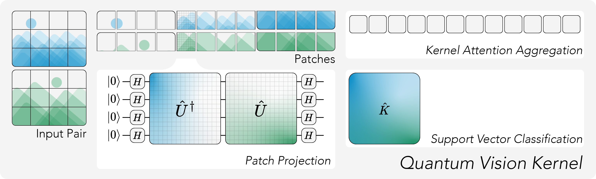

# Quantum Vision Kernels



## Installation

Install the required dependencies:

- [`torchquantum`](https://github.com/mit-han-lab/torchquantum) for efficient quantum simulations
- `sklearn` for fitting the SVMs and preparing the datasets
- `matplotlib` for plotting the results
- `pandas` and `numpy` for data handling

```bash
pip install -r requirements.txt
```

### Datasets

We use the `mnist_784` and `cifar10` datasets retrieved through sklearn.

## Running Evaluation

Scripts for running the evaluations are stored in the `run/` folder.

To reproduce the experiments from the paper, use:

```bash
python run/1-mnist.py
```

Configs and cpu times are written to `runs.csv`, logs are written to the `logs/` folder and can be plotted using:

```bash
python run/plot mnist
```

The generated plots will also be stored in the  `logs/` folder.

To cumulate the compute time, run `python metrics/compute`
